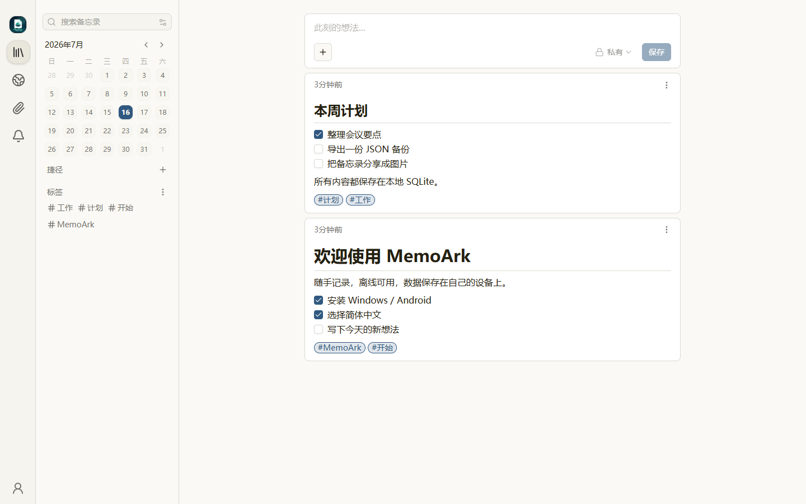
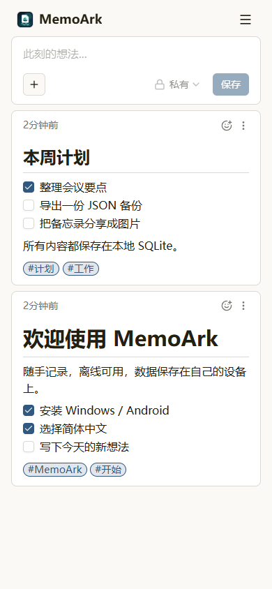

<p align="center">
  
</p>

<h1 align="center">MemoArk</h1>

<p align="center">
  <strong>无需服务器也能使用的本地笔记应用</strong><br />
  Windows、Android 和自托管均可用，核心功能离线运行，数据由自己保管。
</p>

<p align="center">
  <a href="https://github.com/harrychin-cn/memoark/releases/latest"><strong>下载最新版</strong></a>
  · <a href="docs/user-guide-zh-CN.md">中文使用说明</a>
  · <a href="ROADMAP.md">开发路线</a>
  · <a href="https://github.com/harrychin-cn/memoark/issues/new?template=bug_report.yml">反馈问题</a>
</p>

MemoArk 是一个基于 [Memos](https://github.com/usememos/memos) 的独立开源项目，保留轻量、Markdown 优先的体验，重点加强
本地使用、草稿保护、故障恢复和数据迁移能力。

> **项目状态：** 正在持续完善。当前基线为 Memos `v0.29.1`，已经提供可直接安装的 Windows 和 Android 完整本地版。

## 为什么选择 MemoArk

| 能力 | 说明 |
| --- | --- |
| **开箱即用** | Windows 安装包和 Android APK 内含运行所需组件，普通用户不需要部署服务器。 |
| **核心功能离线可用** | 本地后端和 SQLite 数据库随应用运行，没有网络也能启动、编辑和读取笔记。 |
| **草稿安全** | 未保存内容自动缓存在当前设备，可恢复、丢弃，并在版本冲突时明确提醒。 |
| **完整笔记体验** | 支持 Markdown、标签、待办、附件、录音、位置、评论、搜索、过滤、归档和分享图片。 |
| **数据可迁移** | 支持 JSON 导入导出；Windows 用户还可以完整备份本地数据目录。 |
| **多语言界面** | 提供 33 种界面语言，并支持浅色、深色、纸张和跟随系统主题。 |

## 界面预览

<table>
  <tr>
    <td width="70%"></td>
    <td width="30%"></td>
  </tr>
  <tr>
    <td align="center">Windows / 桌面界面</td>
    <td align="center">Android / 手机界面</td>
  </tr>
</table>

## 下载和开始使用

前往 [GitHub 最新版本页面](https://github.com/harrychin-cn/memoark/releases/latest)，按设备选择文件：

| 使用方式 | 下载文件 | 安装方法 |
| --- | --- | --- |
| Windows 普通用户 | `MemoArk-Setup.exe` | 双击安装，自动创建桌面和开始菜单快捷方式。 |
| Windows 便携使用 | `windows-amd64.zip` | 完整解压后运行 `START-MemoArk.cmd`。 |
| Android 手机 | `Android.apk` | 允许当前下载应用“安装未知应用”后安装。 |

第一次打开时创建管理员账号即可开始记录。Windows 默认数据目录为 `%LOCALAPPDATA%\MemoArk`；Android 数据保存在 App 私有目录。
升级时直接覆盖安装，不要先卸载旧版本。

安装、编辑、附件、分享、备份、升级和排错请查看完整的 [中文功能使用说明](docs/user-guide-zh-CN.md)。

### English

MemoArk is a reliable, Markdown-first note app with installable Windows and Android local editions plus a self-hosted edition. Its local
packages include the frontend, backend, and SQLite database, while draft recovery and portable exports help protect unfinished work and
keep data under the user's control.

Development priorities are tracked in the [MemoArk roadmap](ROADMAP.md), with the public upstream feedback behind each decision kept
in [the research snapshot](docs/product/upstream-feedback-2026-07-13.md).

## Server quick start

Prerequisites: Git, Node.js 24+, pnpm 11+, and Docker.

```bash
git clone https://github.com/harrychin-cn/memoark.git
cd memoark

cd web
pnpm install --frozen-lockfile
pnpm release
cd ..

docker compose -f scripts/compose.yaml up -d --build
```

Open [http://localhost:5230](http://localhost:5230). The default Compose file binds only to localhost, and runtime data is stored in
the Docker volume `memoark-data`.

Stop the instance without deleting its data:

```bash
docker compose -f scripts/compose.yaml down
```

Before upgrading an existing SQLite database, MemoArk creates and verifies a backup when schema migrations are pending. See
[SQLite migration backups and restore](docs/operations/sqlite-migration-backups.md) for the backup location, Docker behavior, and manual
restore procedure.

## Windows local development package

The release page provides a normal Windows installer and a portable archive. The program, database, and attachments stay on the same
Windows computer, and the local service binds only to `127.0.0.1`. User data is stored under `%LOCALAPPDATA%\MemoArk` by default and
is retained across upgrades and uninstallation.

Maintainers can build the complete Windows and Android release set from a clean source worktree:

```powershell
powershell -NoProfile -ExecutionPolicy Bypass -File scripts/package-complete-release.ps1 -Version 0.29.1-memoark.12 -AndroidVersionCode 12
```

The output includes `MemoArk-Setup.exe`, the portable ZIP, a signed Android APK, SHA-256 checksums, release manifests, notices, and
CycloneDX SBOMs. See the [user guide](docs/user-guide-zh-CN.md) for end-user instructions.

## Development

Frontend:

```bash
cd web
pnpm install --frozen-lockfile
pnpm test
pnpm lint
pnpm dev
```

Backend:

```bash
go test ./...
go run ./cmd/memos --port 8081
```

The Go module path, API resource names, `MEMOS_*` environment variables, binary name, and data directory remain compatible with the
upstream project for now. This is intentional and avoids a risky mass rename.

## Trust and disclosures

- [Privacy / 隐私说明](PRIVACY.md) explains what a self-hosted instance stores, the browser data used by MemoArk, and optional
  connections to services configured by an instance operator.
- [Advertising and sponsorship / 广告与赞助披露](docs/ADVERTISING.md) records the project's current commercial relationships and
  the rules for advertising, sponsorships, and affiliate links.
- [Trademarks and project identity / 商标与项目标识](TRADEMARKS.md) distinguishes factual upstream attribution from affiliation or
  endorsement.
- [Third-party notice source baseline](THIRD_PARTY_NOTICES) and [distribution compliance](docs/COMPLIANCE.md) explain the
  tracked dependency baseline, exact release notices/SBOMs, and reproducible container/native-package release steps.

The MemoArk-maintained distribution currently contains no paid placement or affiliate links. Any future paid, sponsored, or affiliate
content must be clearly labelled **where it appears / 在内容实际展示位置就地标注**. A link to a central policy alone is not enough;
the nearby label must identify the commercial relationship and who benefits from it. Self-hosted instance operators remain responsible
for content and integrations they add independently.

## Reporting problems

- [Bug reports](https://github.com/harrychin-cn/memoark/issues/new?template=bug_report.yml)
- [Feature requests](https://github.com/harrychin-cn/memoark/issues/new?template=feature_request.yml)
- [Security reports](https://github.com/harrychin-cn/memoark/security/advisories/new)

Please include the MemoArk version, deployment method, database type, and clear reproduction steps.

## Upstream and license

MemoArk is based on Memos and is not affiliated with or endorsed by the original Memos project. The full upstream Git history is kept
so changes remain traceable and future security updates can be reviewed cleanly.

The original Memos copyright and MIT license are preserved in [LICENSE](LICENSE). MemoArk's attribution details are recorded in
[NOTICE](NOTICE). Changes made for MemoArk are also distributed under the MIT License. See [TRADEMARKS.md](TRADEMARKS.md) for the
separate rules covering project names and visual identity.
