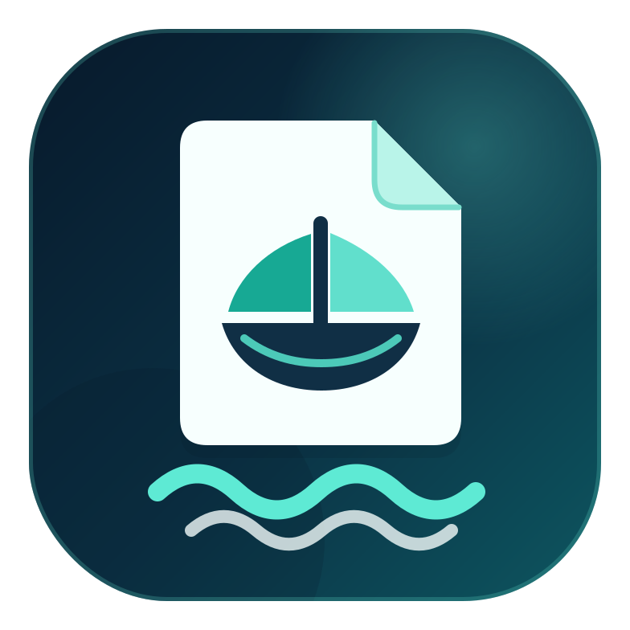

# MemoArk



**Reliable, self-hosted notes with draft safety and portable data.**

MemoArk is an independent open-source project based on [Memos](https://github.com/usememos/memos). It keeps the lightweight,
Markdown-first experience while focusing on the failure cases that make people lose trust in note apps.

> **Project status:** early development. The current baseline is Memos `v0.29.1` at commit `5f194da`.

## What MemoArk adds

- **Edit draft protection** — unsaved edits are cached locally while you type.
- **Visible recovery** — restore or discard a recovered draft instead of silently overwriting server content.
- **Conflict awareness** — warns when the server copy changed after the local draft was created.
- **Portable export** — download normal and archived notes as versioned JSON.
- **Self-hosted by default** — your database stays on infrastructure you control.

Development priorities are tracked in the [MemoArk roadmap](ROADMAP.md), with the public upstream feedback behind each decision kept
in [the research snapshot](docs/product/upstream-feedback-2026-07-13.md).

## Quick start

Prerequisites: Git, Node.js 24+, pnpm 11+, and Docker.

```bash
git clone https://github.com/harrychin-cn/memoark.git
cd memoark

cd web
pnpm install --frozen-lockfile
pnpm release
cd ..

docker compose -f scripts/compose.yaml up -d --build
```

Open [http://localhost:5230](http://localhost:5230). The default Compose file binds only to localhost, and runtime data is stored in
the Docker volume `memoark-data`.

Stop the instance without deleting its data:

```bash
docker compose -f scripts/compose.yaml down
```

## Development

Frontend:

```bash
cd web
pnpm install --frozen-lockfile
pnpm test
pnpm lint
pnpm dev
```

Backend:

```bash
go test ./...
go run ./cmd/memos --port 8081
```

The Go module path, API resource names, `MEMOS_*` environment variables, binary name, and data directory remain compatible with the
upstream project for now. This is intentional and avoids a risky mass rename.

## Reporting problems

- [Bug reports](https://github.com/harrychin-cn/memoark/issues/new?template=bug_report.yml)
- [Feature requests](https://github.com/harrychin-cn/memoark/issues/new?template=feature_request.yml)
- [Security reports](https://github.com/harrychin-cn/memoark/security/advisories/new)

Please include the MemoArk version, deployment method, database type, and clear reproduction steps.

## Upstream and license

MemoArk is based on Memos and is not affiliated with or endorsed by the original Memos project. The full upstream Git history is kept
so changes remain traceable and future security updates can be reviewed cleanly.

The original Memos copyright and MIT license are preserved in [LICENSE](LICENSE). MemoArk's attribution details are recorded in
[NOTICE](NOTICE). Changes made for MemoArk are also distributed under the MIT License.
